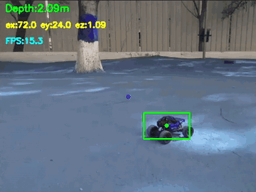
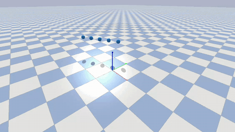
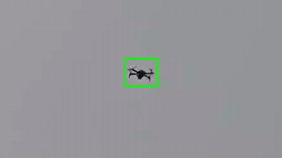

## Prakhar Gupta

Student at **IIIT Hyderabad** working on autonomous drones and the software that runs them.

Currently researching decentralized swarm coordination with multi-agent RL (MADDPG, moving to recurrent MAPPO) at the Robotics Research Center. In summer 2026 I interned as an ML engineer at Latitude 54, building the perception and decision layer of an autonomous-airspace simulation. Finalist in the MathWorks Minidrone Competition, India 2025. Outside robotics I build full-stack web apps, ML pipelines, and systems code in C.

**[Website](https://pg1590.github.io)** · [LinkedIn](https://www.linkedin.com/in/prakhar-gupta-199744271/) · [Email](mailto:prakhargupta058@gmail.com) · [Resume](https://pg1590.github.io/Prakhar_Gupta_Resume.pdf)

<table>
  <tr>
    <td align="center"></td>
    <td align="center"></td>
    <td align="center"></td>
  </tr>
  <tr>
    <td align="center">Real-flight RC car following on a Tello</td>
    <td align="center">Multi-agent swarm formations (PyBullet)</td>
    <td align="center">YOLOv8 drone detection, outdoors</td>
  </tr>
</table>

---

### Robotics & Autonomy

| Project | What it is | Stack |
| --- | --- | --- |
| [**Swarm Drone Coordination**](https://github.com/pg1590/Swarm-Drones-Detection-Tracking-Path-Prediction-and-Navigation) | Decentralized multi-UAV target pursuit, formation control, and collision avoidance trained with MARL (CTDE) | Python · PyBullet · MADDPG / MAPPO |
| [**Vision-Based Target-Following Drone**](https://github.com/pg1590/vision-based-target-following-drone-sim) | A Tello chaser drone that detects another drone with YOLOv8 and pursues it with PID control across figure-8, helix, spiral, and zig-zag paths | Python · YOLOv8 · OpenCV · djitellopy |
| [**RC Car Follower Drone**](https://github.com/pg1590/UAV-Project) | A Tello that follows a moving RC car outdoors using a custom-trained YOLOv8 detector, CSRT tracking, a Kalman filter, and PID control | Python · YOLOv8 · OpenCV · djitellopy |
| [**MathWorks Minidrone Line Follower**](https://github.com/pg1590/mathworks-minidrone-line-follower) | Competition finalist: red-line tracking, arc look-ahead, and landing-marker detection for a Parrot minidrone | MATLAB · Simulink · Stateflow |

### Software & AI

| Project | What it is | Stack |
| --- | --- | --- |
| [**AI Site Builder**](https://github.com/pg1590/AI-Website-Builder) | Full-stack SaaS that generates and iterates websites from prompts, with auth, version history, a public gallery, and Stripe credits | React · TypeScript · Express · Prisma · PostgreSQL |
| [**Cancer Stratification System**](https://github.com/pg1590/Cancer-Stratification-System) | X-ray risk assessment with an XGBoost pipeline behind a role-based web app for patients, doctors, and radiologists | Python · XGBoost · Node.js · React · MongoDB · Docker |
| [**AI Claims Assessment**](https://github.com/pg1590/AI-CLAIMS-ASSESMENT-FOR-CAR-INSURANCE) | Car-insurance claim triage: YOLOv8 damage detection, severity and cost estimation, and fraud checks | Python · YOLOv8 · Streamlit |
| [**xv6 Extensions**](https://github.com/pg1590/Xv6) | New syscalls (syscall counting, alarms) plus lottery and MLFQ schedulers in the xv6 kernel | C · RISC-V |
| [**Unix Shell**](https://github.com/pg1590/C-shell) | A POSIX-style shell with pipes, redirection, job control, and signal handling | C · Linux |

### Hardware

| Project | What it is | Stack |
| --- | --- | --- |
| [**HLS GEMM Accelerators**](https://github.com/pg1590/HLS-GEMM-Accelerators-on-AMD-Xilinx-FPGA) | Matrix-multiply kernels on an Alveo U50 FPGA: tiling, systolic arrays, dataflow, INT8 | C++ · Vitis HLS |
| [**RISC-V Core**](https://github.com/pg1590/RISC-V-Core) | Sequential and pipelined processors with forwarding and hazard detection | Verilog |
| [**32×32 SRAM with Decoder**](https://github.com/pg1590/32x32-SRAM-Module-with-a-Decoder) | Transistor-level 6T SRAM macro, 78.3 ps end-to-end at 0.9 V | Cadence Virtuoso |

---

### Tools I work with

**Languages:** Python · C · C++ · TypeScript · JavaScript 
**Robotics & ML:** PyBullet · Stable-Baselines3 · Gymnasium · PyTorch · YOLOv8 · OpenCV · MATLAB/Simulink 
**Web & Backend:** React · Node.js · Express · Prisma · PostgreSQL · MongoDB · Docker 
**Hardware:** Verilog · Vitis HLS · Cadence Virtuoso
